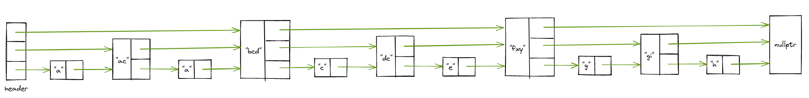
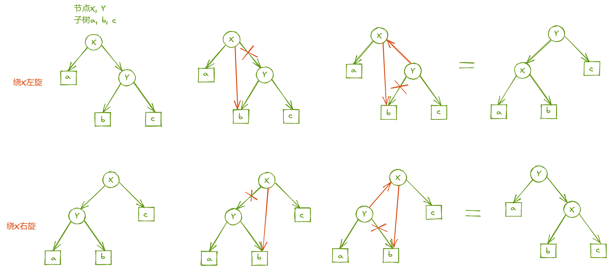

# 基于跳表的key-value store
## 跳表skiplist
- 跳表查询、插入、删除的时间复杂度均为O(logN)
- 跳表的空间复杂度为O(N)
- 相比于RBtree，跳表的实现更为简单，且能实现按照区间查找数据
- RBtree采用左/右旋动态更新
- Redis中的有序集合即采用跳表

- RBtree采用左/右旋动态更新数据，跳表也需要动态维护索引，借助随机函数更新索引


```c++
/*
    随机生成[1, kMaxLevel]间的数，1的概率1/2，2的概率1/4，3的概率1/8...
    返回1时不建索引，返回2建一级索引，返回3建二级索引...
  */ 
  int randomLevel()
  {
    int level = 1;
    /* 
      rand() % 2有1/2概率生成0，1/2概率生成1
      level返回1的概率1/2，返回2的概率1/2(第一次循环生成1)*1/2(第二次循环生成0)=1/4
      返回3的概率1/2*1/2*1/2=1/8...
    */
    while (rand() % 2 && level < kMaxLevel)
      level++;
    
     return level;
  }
```

# 对外接口
- searchElement()  查询数据
- insertElement()  插入数据
- deleteElement()  删除数据
- updateElement()  更新数据
- displaySkiplist()    展示数据
- clearSkiplist()  清除数据
- dumpFile()   数据落盘
- loadFile()   加载数据
- size()   获取数据规模

# key-value store using google/benchmark
跳表高度：18
```
--------------------------------------------------------------------
Benchmark                          Time             CPU   Iterations
--------------------------------------------------------------------
benchmark_insert/18/10000 1124001039 ns    412418022 ns            2
benchmark_insert/18/100000 1.2009e+10 ns   4562885306 ns            1
benchmark_insert/18/500000 7.1313e+10 ns   2.6616e+10 ns            1
benchmark_search/18/10000  167249872 ns    154498136 ns            4
benchmark_search/18/100000 2196137493 ns   2075338956 ns            1
benchmark_search/18/500000 1.1502e+10 ns   1.0762e+10 ns            1
benchmark_delete/18/10000   79145271 ns     74339137 ns            9
benchmark_delete/18/100000 1638887098 ns   1454278052 ns            1
benchmark_delete/18/500000 8235816014 ns   7386500477 ns            1
benchmark_update/18/10000  312082126 ns    310157187 ns            2
benchmark_update/18/100000 3304066567 ns   3260226285 ns            1
benchmark_update/18/500000 1.7145e+10 ns   1.7079e+10 ns            1
```

# 待优化
- [ ] 将随机读写改为顺序读写，增强写操作的性能，需要结合LSM-Tree
- [x] 压力测试自动化