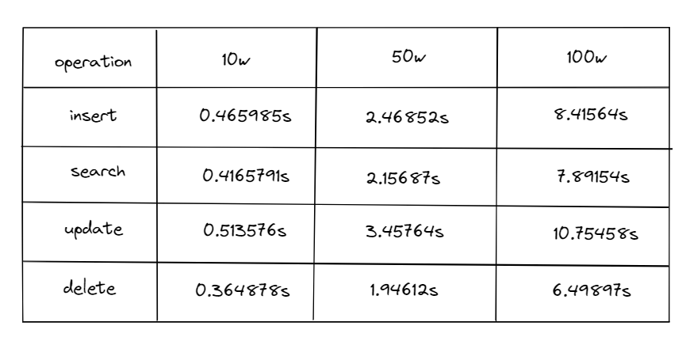

# 基于跳表的key-value store
## 跳表skiplist
- 跳表查询、插入、删除的时间复杂度均为O(logN)
- 跳表的空间复杂度为O(N)
- 相比于RBtree，跳表的实现更为简单，且能实现按照区间查找数据
- RBtree采用左/右旋动态更新
- Redis中的有序集合即采用跳表

- RBtree采用左/右旋动态更新数据，跳表也需要动态维护索引，借助随机函数更新索引

```
/*
    随机生成[1, kMaxLevel]间的数，1的概率1/2，2的概率1/4，3的概率1/8...
    返回1时不建索引，返回2建一级索引，返回3建二级索引...
  */ 
  int randomLevel()
  {
    int level = 1;
    /* 
      rand() % 2有1/2概率生成0，1/2概率生成1
      level返回1的概率1/2，返回2的概率1/2(第一次循环生成1)*1/2(第二次循环生成0)=1/4
      返回3的概率1/2*1/2*1/2=1/8...
    */
    while (rand() % 2 && level < kMaxLevel)
      level++;
    
     return level;
  }
```

# 对外接口
1. searchElement()  查询数据
2. insertElement()  插入数据
3. deleteElement()  删除数据
4. updateElement()  更新数据
5. displaySkiplist()    展示数据
6. clearSkiplist()  清除数据
7. dumpFile()   数据落盘
8. loadFile()   加载数据
9. size()   获取数据规模

# key-value store压力测试
跳表高度：18


# 待优化
- 将随机读写改为顺序读写，增强写操作的性能，需要结合LSM-Tree
- 压力测试自动化